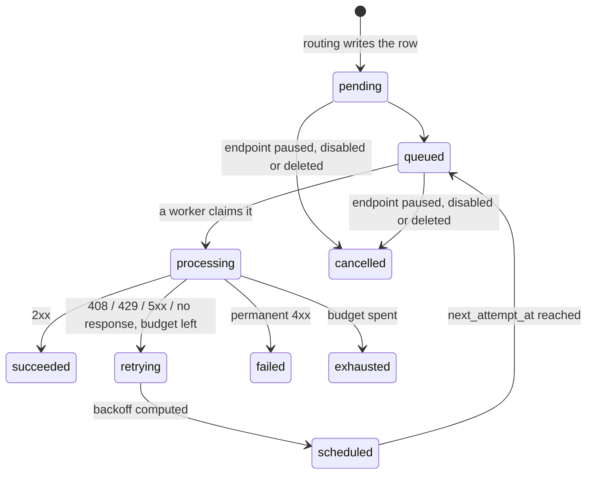

# Events and deliveries

This is the page the product is judged on at 2am. Three words carry it:

| Word | What it is | You see one per |
|---|---|---|
| **Event** | A fact your system published, once. | publish |
| **Delivery** | One event to one endpoint, created up front - before anything is sent - with its own retry chain. | matching subscription |
| **Attempt** | One HTTP request. | try |

An event you published once appears under Deliveries once per matching
subscription, and each row retries independently. "Did finance ever receive
this?" is a row lookup.

## Events

### The list

`/orgs/:orgId/projects/:projectId/events` shows everything published to the
project, newest first: the event id and type, its status, the idempotency key
the producer sent (or "-"), the payload size (with "offloaded" when the bytes
are held in object storage), and when it was received.

Filters, all carried in the URL:

| Filter | Matches | Cost |
|---|---|---|
| Event type | Exact type, e.g. `payment.settled`. No wildcards. | Indexed. |
| Idempotency key contains | Case-insensitive substring of the producer's key, **3 characters minimum**. This is the "the producer says they sent order 41f9, did we get it?" search. | A scan of everything the other filters left. Pair it with a date range on a busy project (the API accepts `created_after`/`created_before`). |
| Status | `received`, `processing`, `processed`, `failed`. | A scan. |

There is no free-text search, and no routing column: the list cannot say how
many deliveries an event produced without one request per row. The detail
page has it.

### Event status

An event's status is its **ingest and routing** state, not a delivery
outcome:

| Status | Meaning |
|---|---|
| `received` | Accepted and stored; the router has not routed it yet. |
| `processing` | A router holds it and is writing delivery rows. |
| `processed` | The routing committed. This says nothing about whether any endpoint accepted it - that is what the deliveries are for. An event that matched no subscription is also `processed`, with zero deliveries. |
| `failed` | **Parked.** The router gave up before writing any delivery rows. See [Stuck events](#stuck-events-parked-before-routing). |

### Event detail

`/orgs/:orgId/projects/:projectId/events/:eventId` leads with the routing,
stated as a sentence: "Published once, routed to *N* deliveries - one per
matching subscription", with counts of succeeded, still going, failing and
exhausted derived from the rows beneath (so the summary cannot disagree with
the table). A `failed` event shows the parked notice instead, with its
requeue.

Three facts follow: payload size; the idempotency key (re-publishing with it
returns this event instead of creating another; without one, a publisher that
retries creates a second event); and the ordering key (stored, and carried
onto every delivery, but **per-key ordering is not enforced** - deliveries
for an event are unordered).

Then three tabs:

- **Deliveries** - one row per matching subscription: endpoint, status,
  outcome in words, attempts `n/max`, next attempt. Empty means "no enabled
  subscription matched, so nothing was queued".
- **Payload** - the body **as it was received and delivered**, which is what
  was signed. The tab says where the bytes came from:

  | Source | What you see |
  |---|---|
  | `inline` | The exact bytes, with their SHA-256. Shown as text when they are valid UTF-8, as base64 otherwise (never as replacement characters that look like data). |
  | `object_storage` | No body; the payload exceeded the inline threshold and the location is shown. Fetch it from there. |
  | `unavailable` | No body and no location: retention has removed it, or the event predates raw storage. |

  The API also returns `normalised_json`, a parsed copy kept for filtering
  and display. It is **not** what was delivered - JSON storage does not
  preserve key order, whitespace or duplicate keys - and a signature computed
  over it will not match. The response carries a notice saying so.
- **Headers** - the headers the producer sent on the ingest call. Credential
  values (`Authorization` among them, which carries your own API key) are
  shown as `[redacted]`; the names stay.

## Deliveries

### The list

`/orgs/:orgId/projects/:projectId/deliveries` is one row per event per
endpoint, newest first: delivery id and the event id it came from (with
"replay" when it is one), the endpoint, the status, the outcome in words,
attempts `n/max`, and when it was created. A row carries ids, not the event
type or a status code; the detail page has both.

Filters:

| Filter | Meaning |
|---|---|
| **Failing now** | `retrying`, `failed` and `exhausted` together: everything that has failed and not recovered. **Cannot be combined with Status** - the API refuses the pair rather than picking one, so the status select is disabled while this is on. |
| Status | One of the nine states below. |
| Endpoint | One page of the project's endpoints. |
| Event type | Exact match. Not indexed; pair it with an endpoint or a date range on a busy project. |
| Origin | Originals only, replays only, or both (the default - a replay is a real delivery, and hiding it would make the ledger lie). |

The API also accepts `event_id` and `created_after`/`created_before`.

### Delivery status

The nine states, with the sentence the dashboard's own legend uses ("What do
these statuses mean?", above the filters):

| Status | Meaning | Final? |
|---|---|---|
| `pending` | Created, but not yet handed to the queue. | |
| `scheduled` | Waiting for a specific time before its next attempt - usually a retry backoff. | |
| `queued` | Waiting for a free worker. No request has been made yet. | |
| `processing` | A request is in flight to the endpoint right now. | |
| `succeeded` | The endpoint answered 2xx. Nothing further will happen. | final |
| `failed` | The latest attempt failed and more attempts remain. It will be retried. | |
| `retrying` | A previous attempt failed and the next one is already scheduled. | |
| `exhausted` | Every attempt was used and none succeeded. Nothing further will happen without a replay. | final |
| `cancelled` | Stopped before it finished - the endpoint was deleted, disabled or paused, or an operator cancelled it. | final |

`failed` and `exhausted` are the pair to keep apart: `failed` is one failed
attempt, `exhausted` is the end of the chain.

### Delivery detail

`/orgs/:orgId/projects/:projectId/deliveries/:deliveryId` is built to make
the cause obvious in five seconds, so it leads with a written **diagnosis**
rather than a grid of fields:

- A headline ("Gave up after all 8 attempts.", "Attempt 3 failed. 5 attempts
  left.") and a badge classifying the failure: **No HTTP response** (DNS,
  refused connection, timeout or TLS - there is no status code, and the
  page never invents one), **Temporary HTTP failure** (408, 429, 5xx - will
  be retried), **Permanent HTTP failure** (any other 4xx - the chain stops
  here; a 401 or 403 usually means signature verification is failing on the
  consumer).
- The last error, verbatim, in monospace, for pasting into a thread with the
  consumer's team.
- **What happens next**, stated definitively.

Under it, when the endpoint itself is not delivering, a red panel: "No retry
will run - the circuit breaker has disabled this endpoint" (or "this endpoint
is paused"). The delivery may still read `retrying`, but no attempt will be
made until the endpoint is back. The panel carries the platform's reason and
the same **Resume** / **Pause** actions as the Endpoints page, so the cure is
next to the diagnosis. See [Endpoints](./04-endpoints.md#pause-resume-and-resume-anyway).

Then four tiles: **Attempts** ("Attempt 3 of 8", with pips), **Last
response** (`HTTP 504`, "No response", or "Unknown - detail reclaimed"),
**Next attempt** (relative and absolute; "None - chain stopped" once
final), **Completed**.

Then three tabs:

**Attempts** - newest first, one card per request: its number, a badge
(the status code, or the failure kind when there was no response, plus "not
retried" for a permanent 4xx), duration ("in flight" while it has none), when
it started, the error code and message, the response headers and the response
body (truncated by the worker to the installation's limit; a body held in
object storage says so with its size). Each attempt also has its own
**trace id** when that attempt's span was sampled - look it up in your tracing
backend. Null means no trace was kept, not that tracing is broken.

The attempt history is embedded in the page. A delivery with more than 100
attempts says so and loads the rest.

**Same event** - the sibling deliveries the same event routed to, with
"You are here" on this one. This is where "did finance get it?" is answered.

**Request** - the headers sent on the latest attempt. The signature is
recomputed per attempt, so earlier attempts carry different
`Webhook-Signature` and `Webhook-Timestamp` values; open an attempt to see
its own. Credential-shaped header values are `[redacted]`; the signature
header is not, because it is what a consumer compares against. The **body is
on the event** - it is stored once, however many deliveries - and the tab
links to it.

### Pruned attempt detail

Attempts carry the bytes (headers, bodies, timings) and are kept for a
shorter window than the delivery row that summarises them. Past that
horizon the page says "5 attempts were made; the detail was reclaimed by
retention on *date*" rather than "No attempts yet". The status, the attempt
count and the last error are still the record; only the per-attempt bytes
are gone, so the last response reads "Unknown - detail reclaimed" rather than
claiming a transport failure.

## Replay

Replay re-sends a delivery that has stopped. It is a **new row**, never a
reset: the original keeps its status, its attempt count and its attempt
history; the new row carries `replay_of_delivery_id` pointing back and
`replayed_by` naming who asked, starts at attempt 0 with the original's
attempt budget, and is queued immediately. Both rows stay in the ledger;
replaying a replay is allowed.

Replay needs `deliveries.replay` (and, for an event, `events.replay`) -
owner, admin and developer. **Viewers cannot replay**: it puts real HTTP
traffic on a consumer.

**Replay delivery** on the detail page is offered once the chain has stopped
and did not succeed (`exhausted` or `cancelled`). The confirmation says only
this endpoint is retried; the other deliveries for the event are untouched.

**Replay event** on the event page fans the event out **again to every
endpoint it originally reached**, read off its existing delivery rows - never
by re-running the subscription match against today's subscriptions. The
confirmation warns that consumers receive a duplicate, so it is safe only
for consumers that deduplicate on `Webhook-Id`. Through the API you can
narrow it to one endpoint with `endpoint_id`, and both routes take an
optional `reason` (up to 500 characters) that goes to the audit log.

Refused:

- the endpoint has since been deleted, disabled or paused (the worker would
  abandon the delivery rather than make it) - for an event replay, one dead
  endpoint refuses the whole request;
- an endpoint the event never reached (that is a new delivery, not a replay);
- more than **50** deliveries in one event replay - replay per endpoint
  instead.

Event replay is rate limited to 10 per five minutes, delivery replay to 30,
per address. See [Replay](/guide/07-replay) for the consumer-side view.

## Stuck events (parked before routing)

**This screen is not in the navigation.** Most projects have nothing stuck most
of the time, so it is reached the two ways that matter: a notice on Deliveries
and on Overview that appears when something *is* stuck, and its address —
`/orgs/<org>/projects/<project>/outbox` — which keeps working in a pasted link.
When the check itself fails, the notice says so rather than staying silent: on
those two screens, silence would read as "nothing is stuck".

`/orgs/:orgId/projects/:projectId/outbox` is the router's record of what it
still owes each accepted event. It opens on the rows that need a person.

Publishing an event answers `202 Accepted` once the event and its outbox row
are stored together. A router then claims the row and writes one delivery per
matching subscription. When it cannot - a row that keeps killing the router,
or one still failing after the retry window - it **parks** the row and marks
the event `failed`. A parked event has **no delivery rows**: nothing appears
under Deliveries and replay has nothing to work from. Until someone requeues
it, an event the publisher was told was accepted will never be delivered.

### Statuses

| Status | Label | Meaning |
|---|---|---|
| `pending` | Queued | Waiting for a router to claim it - possibly in a backoff (shown with "failing since"), possibly mid-routing (shown with its resume point). |
| `processing` | Routing | A router holds the lease and is writing delivery rows. The row shows which replica. |
| `processed` | Routed | Every matching subscription has its delivery row. |
| `failed` | **Parked** | The router gave up. Nothing will be delivered until it is requeued. |

The status filter defaults to Parked; "Any status" widens it. Filtering by
event id links straight to the event.

### Why a row parks

The row says why in the router's own words (`last_error`), and the two
counters beside it are the diagnosis:

| Counter | Meaning |
|---|---|
| **Claims** (`attempts`) | How many times a router has picked the row up. Monotonic; a requeue does not reset it. |
| **Unaccounted** (`unaccounted_attempts`) | Claims that ended with the router writing **nothing** - a crash, an out-of-memory kill, a lease left to lapse. This is the poison bound: more than 5 parks the row. A failure the router observed and recorded does not count here. |

| Reason | Headline | What it means | Requeue outlook |
|---|---|---|---|
| `attempts_exhausted` | The router kept dying on this event | Every unaccounted claim ended without an outcome. That is the signature of an event the router cannot survive, not of an outage. Look at the payload first; put back unchanged it will most likely park again. | caution |
| `retry_duration_exceeded` | Kept failing for longer than the retry window | Every failure was recorded - the database or a subscription lookup was erroring under the router for more than an hour (the default window), not the event itself. Once the cause is fixed, requeueing is the whole recovery. | safe |
| `unknown_outbox_type` | The router does not handle this row type | Parked on sight. Requeueing changes nothing until a router that understands the type is deployed. | futile |
| `event_missing` | The event this row points at no longer exists | Nothing to route; evidence of a deleted or lost event, not work to recover. | futile |

"Routing partly done" on a row means some endpoints already have their
delivery for this event and the rest are still owed one; a requeue resumes
from the recorded subscription rather than re-sending to endpoints it already
reached.

### Requeue

Requeue is **not replay**. It does not create deliveries; it puts the outbox
row back to Queued and the event back to `received`, and lets the router run
the routing it never got to run. That routing is bounded to the subscriptions
that existed when the event was accepted, using their configuration as of
now: a subscription disabled since applies, one deleted since is gone. The
router's `last_error` and the claim count are preserved so the history
survives the recovery; the unaccounted count and the failing-since clock are
reset, because you have looked at the row and decided it deserves a fresh
budget.

Two forms, both needing the same permissions as event replay (owner, admin,
developer; not while the organization is suspended). The button is disabled
with the reason when your role cannot press it.

- **Requeue** on a row opens a dialog that repeats the diagnosis and the
  requeue semantics and asks for a **reason** - required in the dashboard,
  up to 500 characters, recorded on the audit entry (never on the row). The
  button reads "Requeue anyway" when the outlook is caution or futile. Only a
  parked row can be requeued; anything else is refused with a conflict that
  names the row's real state.
- **Requeue parked, 100 at a time** (or "Requeue this event's parked rows"
  when filtered to one event) returns up to **100** parked rows to the queue
  per pass, oldest first. Each pass is an explicit press: every requeued row
  becomes real outbound HTTP, usually to endpoints that were already
  struggling when the incident started, and the route allows 10 passes per
  five minutes. The dialog tallies every pass and always says whether **more
  remain** or "that was all of them". A pass that fails does not undo the
  passes before it; they committed. Requeueing when nothing is parked
  requeues zero and records that in the audit log.

After a requeue the delivery rows appear on the event page as the routing
writes them.

---

**Where this comes from** (for maintainers):
`apps/dashboard/src/features/events/EventsPage.tsx`, `EventDetailPage.tsx`, `api.ts`,
`apps/dashboard/src/features/deliveries/DeliveriesPage.tsx`, `DeliveryDetailPage.tsx`,
`api.ts`, `next-attempt.ts`, `pruned.ts`, `apps/dashboard/src/lib/delivery-status.ts`
(`DELIVERY_STATUS_SENTENCE`, `diagnoseDelivery`, `canReplay`, `isRetryableStatusCode`),
`apps/dashboard/src/components/StatusLegend.tsx`,
`apps/dashboard/src/features/outbox/*` (`OutboxPage.tsx`, `OutboxStatusBadge.tsx`,
`ParkedEventNotice.tsx`, `ParkedExplanation.tsx`, `RequeueDialogs.tsx`, `parked.ts`,
`permissions.ts`, `requeue-loop.ts`),
`apps/control-api/src/events/*` (`events.controller.ts`, `dto/event-response.dto.ts`,
`dto/list-events.query.dto.ts`, `event-payload.ts`),
`apps/control-api/src/deliveries/*` (`deliveries.controller.ts`, `dto/delivery-response.dto.ts`,
`dto/list-deliveries.query.dto.ts`, `dto/replay.dto.ts`, `delivery-limits.ts`
(`MAX_REPLAY_DELIVERIES`, `MAX_INLINE_ATTEMPTS`, redacted headers), `delivery-replay.service.ts`),
`apps/control-api/src/outbox/*` (`outbox.controller.ts`, `outbox.service.ts`,
`dto/outbox-response.dto.ts`, `dto/requeue-outbox.dto.ts`, `outbox-limits.ts`),
`services/data-plane/internal/router/router.go` (`DefaultMaxOutboxAttempts`,
`DefaultMaxOutboxRetryDuration`, park reasons), `services/data-plane/internal/retry/retry.go`
(`ShouldRetry`).
