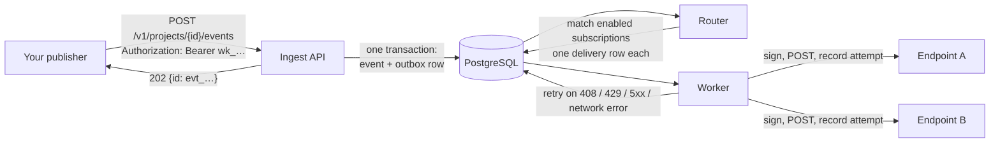

# Concepts and guarantees

What the words mean, what HookuBit promises, and the path one event takes from your `POST` to your receiver's `200`.

## The hierarchy

| Term | What it is | Owned by |
|---|---|---|
| **Organization** | The tenant. Members, roles, billing, the audit log. | You |
| **Project** | A namespace inside an organization, with an environment of `test` or `live` that is fixed at creation. API keys, endpoints, subscriptions and the delivery ledger are all per project. | Organization |
| **Endpoint** | A URL you own that receives webhooks, plus its signing secrets, timeout, concurrency and rate limit, and optional custom headers. | Project |
| **Subscription** | Binds an endpoint to a set of event-type patterns. An event is delivered to an endpoint once per enabled subscription that matches it. | Project |
| **API key** | The credential a publisher presents to the ingest API. `wk_test_…` or `wk_live_…`, matching the project's environment. | Project |
| **Event** | One published fact: an `event_type`, a `data` object, and optionally an `ordering_key`. Stored once, with the exact bytes you sent. | Project |
| **Delivery** | One (event, endpoint) pair. Created by routing, one row per matching subscription, each with its own retry budget and its own history. | Event |
| **Attempt** | One HTTP request made for a delivery, with the request headers, the response, the status, the duration and an error classification. Append-only. | Delivery |

A subscription's `event_types` accepts exactly three forms, and nothing else is stored:

| Pattern | Matches |
|---|---|
| `*` | every event type (and may not be combined with other patterns) |
| `payment.*` | every type beginning with the literal `payment.` - not `payments.settled`, and not the bare `payment` |
| `payment.settled` | that type, byte for byte |

An invalid pattern is refused with a 400 at save time. It is never silently widened to `*` and never stored as something the router would read differently. What you read back from a subscription is exactly the array you sent.

## The path of an event

1. **Ingest.** The request is authenticated, validated and rate-limited, then the event and a row in the outbox are written in **one database transaction**. The `202 Accepted` is sent only after that commit. Nothing reaches any queue or worker before it.
2. **Routing.** The router reads the outbox and matches the event against the project's enabled subscriptions as they existed when the event was accepted. It writes **one delivery row per matching subscription**. This is the materialised routing: one event, N deliveries, each with its own state, its own retry chain and its own attempt history.
3. **Delivery.** Workers claim due deliveries, sign the payload with the endpoint's active secrets, make the HTTP request, and record the attempt. A retryable failure schedules the next attempt; a permanent one ends the delivery.

Because every delivery is a row that exists *before* any request is made, the ledger is the record of what *should* have been delivered. That is what makes "did finance ever receive this?" a query rather than a guess, and it is what makes [replay](./07-replay.md) possible.

## The two guarantees

### At-least-once, per (event, endpoint)

Every delivery is attempted until it succeeds or its retry budget is spent. When the platform must choose between a duplicate delivery and a lost one, it chooses the duplicate - a worker that crashes after your endpoint answered but before the outcome was recorded will re-send. **Your receiver must be idempotent.** Deduplicate on `Webhook-Id` (the event) or `Webhook-Delivery-Id` (the delivery); see [Receiving webhooks](./04-receiving-webhooks.md#be-idempotent).

Routing itself is exactly-once: one event produces at most one *original* delivery per endpoint, enforced by a unique index. Duplicates come from retries and replays, never from routing.

### Nothing is published before COMMIT

`202 Accepted` means the event is durable in the database, not that it has been delivered. If you did not receive a 202 - a timeout, a reset connection, a 5xx - nothing was accepted, and you should retry with the same `Idempotency-Key`. If you did, the event will be routed and delivered whether or not the ingest process survives the next millisecond.

::: warning Unordered by default
Deliveries are made in parallel, retried independently, and may arrive in any order. `ordering_key` is accepted on publish, validated, stored on the event and carried onto every delivery - and **not yet enforced**: it does not currently serialise anything. Design the receiver to tolerate out-of-order arrival (for example, carry a version or a timestamp in `data` and ignore stale updates) rather than relying on a guarantee that is not there yet.
:::

## What "delivered" means

A delivery **succeeds** when your endpoint returns any `2xx` status. Every other outcome is a failure, and failures divide into two kinds:

| Kind | Examples | What happens |
|---|---|---|
| Retryable | `408`, `429`, any `5xx`, connection refused, DNS failure, timeout | Retried on the endpoint's schedule until the budget is spent. |
| Permanent | any other `4xx`, a `3xx` (redirects are not followed), an untrusted certificate, a URL the platform refuses to dial | Ends the delivery on the first attempt. |

The full treatment is in [Retries and delivery](./05-retries-and-delivery.md).

---

*Where this comes from:* `docs/API.md`; `services/data-plane/internal/ingest/errors.go` (package comment, the acceptance order); `services/data-plane/internal/router/store.go` (routing pinned to publish time); `docs/FAILURE_RECOVERY.md` ("Delivery guarantee, stated once"); `apps/control-api/src/webhook-subscriptions/event-type-pattern.ts`; `apps/control-api/src/events/dto/event-response.dto.ts` (`ordering_key`); `services/data-plane/internal/retry/retry.go` (`ShouldRetry`).
