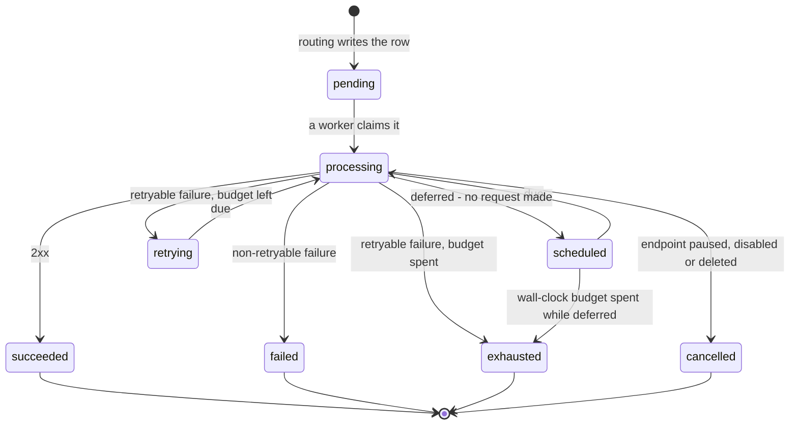

# Retries and delivery

What happens between "the event was accepted" and "your endpoint returned 2xx" - especially when it does not. The schedule, the delivery state machine, the circuit breaker, auto-disable, and the per-endpoint ceilings.

## What is retried

A delivery **succeeds** on any `2xx`. Everything else is a failure, and the platform decides on the first attempt whether retrying could change the answer.

| Outcome | Retried? | Why |
|---|---|---|
| `408 Request Timeout`, `429 Too Many Requests` | yes | The endpoint asked for another try, or for less pressure. |
| any `5xx` | yes | The endpoint is up and having a bad time. |
| connection refused / reset, DNS failure, TLS handshake timeout, read timeout | yes | Transport faults are far more often transient than permanent. |
| expired TLS certificate | yes | Renewing it fixes it. |
| any other `4xx` (`400`, `401`, `403`, `404`, `410`, …) | **no** | A `403` will be a `403` in an hour. Retrying only spends the endpoint's rate budget. |
| any `3xx` | **no** | Redirects are not followed. Register the final URL. |
| untrusted certificate, hostname mismatch | **no** | A human has to fix the certificate. |
| URL refused by egress policy (private, loopback, metadata address) | **no** | The platform declined to dial. Recorded as `blocked_target`. |
| endpoint has no active signing secret | recorded as an attempt, retried | Signing fails closed: nothing is sent unsigned. The delivery is retried on the schedule while the secret is fixed. |

A retryable failure that has run out of budget becomes `exhausted`; a non-retryable one becomes `failed` immediately.

## The default schedule

Every delivery carries a retry budget frozen onto it at routing from the endpoint's retry policy, or the project's default policy, or the built-in default:

| Parameter | Built-in default |
|---|---|
| Strategy | exponential |
| Maximum attempts | 8 (including the first) |
| Initial delay | 5 s |
| Multiplier | 2 |
| Maximum delay | 1 h |
| Jitter | ±20 % of the computed delay |
| Maximum retry duration | 24 h from the first attempt |

Which produces, with the defaults:

| Attempt | Delay after the previous attempt | With jitter | Cumulative (no jitter) |
|---|---|---|---|
| 1 | immediate | - | 0 |
| 2 | 5 s | 4-6 s | 5 s |
| 3 | 10 s | 8-12 s | 15 s |
| 4 | 20 s | 16-24 s | 35 s |
| 5 | 40 s | 32-48 s | 1 min 15 s |
| 6 | 80 s | 64-96 s | 2 min 35 s |
| 7 | 160 s | 128-192 s | 5 min 15 s |
| 8 | 320 s | 256-384 s | ~10 min 35 s |

So under the defaults a dead endpoint is given up on after about **eleven minutes and eight attempts**, not after 24 hours. The 24-hour cap matters when an endpoint's `Retry-After` stretches the schedule, when a delivery spends a long time [deferred](#deferred-not-attempted), or under a policy with more attempts and a longer initial delay.

Jitter is deliberate: a thousand deliveries to one recovering endpoint must not all retry in the same second.

### `Retry-After` is honoured

On a `429` or a `503`, a `Retry-After` header - either form, delay-seconds or an HTTP date - replaces the schedule's computed delay for the next attempt. It is advice, not a command; three bounds apply:

- never less than **1 second** (`Retry-After: 0` would turn the queue into a hot loop),
- never more than the policy's **maximum delay** (1 h by default),
- never past the delivery's **remaining wall-clock budget**.

So an endpoint that asks for an hour gets an hour rather than three attempts in the first thirty-five seconds.

### Per-endpoint retry policies

A project may hold up to 50 retry policies; each endpoint names one (`retry_policy_id`), and the project has one default that endpoints without their own use. Fields and bounds:

| Field | Range | Default |
|---|---|---|
| `strategy` | `exponential`, `linear`, `constant` | `exponential` |
| `max_attempts` | 1-50 | 8 |
| `initial_delay_ms` | 1-86,400,000 | 5,000 |
| `max_delay_ms` | 1-86,400,000 | 3,600,000 |
| `multiplier` | 1-100 (must be > 1 for `exponential`) | 2 |
| `jitter_ratio` | 0-1 | 0.2 |
| `max_retry_duration_ms` | 1,000-604,800,000 (7 days) | 86,400,000 |

`linear` adds `initial_delay_ms` each retry; `constant` repeats it. The budget is copied onto each delivery when it is created, so editing a policy changes deliveries created from then on and never widens or narrows one already in flight.

## The delivery state machine

| State | Terminal | What it means to you |
|---|---|---|
| `pending` | no | Created by routing, not yet picked up. Due immediately. |
| `scheduled` | no | Put back without an attempt - see [deferred](#deferred-not-attempted). `last_error` says why. |
| `queued` | no | Reserved for a future queue implementation; you will not see it today. |
| `processing` | no | A worker holds it and is making, or about to make, a request. If `locked_until` is in the past the worker died; another one will reclaim it. |
| `retrying` | no | The last attempt failed retryably; `next_attempt_at` says when the next one is due. |
| `succeeded` | yes | Your endpoint returned `2xx`. |
| `failed` | yes | A non-retryable outcome: another `4xx`, a `3xx`, a bad certificate, a refused URL. Reason `non_retryable_http_status`, `permanent_error` or `blocked_target`. |
| `exhausted` | yes | Retryable failures until the budget ran out. Reason `attempts_exhausted` (the count) or `retry_duration_exhausted` (the clock). |
| `cancelled` | yes | Stopped on purpose: the endpoint was paused, disabled or deleted before the delivery could complete. Reason `endpoint_disabled` or `endpoint_deleted`. |

Every transition carries a reason, and every attempt is recorded - including attempts that never reached the network because the payload could not be signed. Reading them is covered in [Troubleshooting](./08-troubleshooting.md).

## The circuit breaker

An endpoint that is failing consistently is not worth hammering. Each endpoint has a health state, shared by every worker:

| State | Entered when |
|---|---|
| `healthy` | Any success. |
| `degraded` | 3 consecutive qualifying failures (by default). Flagged for attention; delivery continues. |
| `open` | 5 consecutive qualifying failures (by default). Delivery pressure is removed. |
| `half_open` | The cooldown has passed and one delivery is being used as a probe. |

**What counts** is narrower than what fails a delivery: transport errors, timeouts, `408`, `429` and `5xx`. A `400` or `403` means the endpoint is up and answering, so it does not open the breaker, and a `blocked_target` says nothing about the endpoint at all.

**While open**, deliveries to the endpoint are [deferred](#deferred-not-attempted) rather than attempted - no request, no attempt row, no budget spent. The cooldown starts at **30 seconds** (by default) and **doubles** for each further failure past the threshold, capped at **10 minutes**, with jitter: 30 s, 60 s, 2 min, 4 min, 8 min, then 10 min per cycle for as long as the endpoint stays dead.

**Probing without a thundering herd.** When the cooldown ends, exactly **one** delivery is admitted as a probe - one, across the whole worker fleet, claimed atomically. Every other delivery to that endpoint keeps waiting. If the probe succeeds the endpoint needs **2 consecutive successes** (by default) to close; if it fails, the breaker re-opens immediately with the next, longer cooldown. A worker that dies mid-probe releases the slot after one minute.

## Auto-disable

A breaker that stays open is probed on the order of six times an hour, forever. Meanwhile every new event still routes to the endpoint, each delivery is deferred behind the open breaker, and each expires 24 hours later. That is a backlog with no purpose, so:

An endpoint whose breaker has been continuously open for **72 hours** (by default; the check runs every 15 minutes) is **automatically disabled**:

- `status` becomes `disabled`, `enabled` becomes `false`;
- `disabled_reason` is set to a sentence beginning `auto-disabled:` and `disabled_at` to the time - which is how you tell an automatic disable from one a person did (a human pause leaves `disabled_reason` null and writes the reason to the audit log);
- an `endpoint.auto_disabled` entry is written to the organization's audit log;
- **routing stops creating deliveries for it**, and any delivery still queued is `cancelled` with reason `endpoint_disabled` when a worker next picks it up;
- replay to it is refused with `409` until it is re-enabled.

::: warning Events published while an endpoint is disabled or paused are not queued for it
Routing skips a paused, disabled or deleted endpoint outright; it does not buffer. When you re-enable the endpoint, nothing published in between arrives. If you need those events, [replay](./07-replay.md) them from another endpoint's deliveries, or re-publish.
:::

**Re-enabling** is the ordinary *Enable* action (`POST …/endpoints/{id}/enable`), and it requires the endpoint to have an active signing secret. It clears `disabled_reason` and `disabled_at` and **arms one probe** - it does not reset the breaker's history. The next delivery is the probe; the endpoint must then pass the half-open success count to close the breaker, and a failed probe re-opens it at the accumulated cooldown. This is deliberate: a reset would release the whole backlog at an endpoint whose recovery is, at that moment, only your assertion.

## Deferred, not attempted

A delivery can be put back into the queue **without a request being made**. No attempt row is written and no attempt is charged against the budget, because the retry budget is for endpoints that answered badly, not for moments when the platform declined to ask. The delivery moves to `scheduled` with the reason in `last_error`:

| `last_error` | Meaning | Wait |
|---|---|---|
| `circuit_breaker_open` | The endpoint's breaker is open or another worker holds the probe. | Until the cooldown ends, spread over its tail. |
| `rate_limited` | The endpoint's own rate limit is full. | Until the bucket refills. |
| `concurrency_limit` | The endpoint, project, organization or worker is at its concurrency ceiling. | About 2 s, jittered. |
| `payload_unavailable` | The platform's object storage did not answer for an offloaded payload. The endpoint is fine; the platform is not. | About 2 s, jittered. |
| `worker_shutdown` | The worker was restarting. | About 2 s, jittered. |
| `retry_scheduled` | The delivery row could not be read; a database blip. | About 2 s, jittered. |

The wall clock keeps running while a delivery is deferred. A delivery that is only ever deferred - behind a breaker that never closes, say - still ends: once `max_retry_duration` has passed since its first attempt (or its creation, if there was none) it becomes `exhausted` with reason `retry_duration_exhausted`, zero attempts, and the deferral reason recorded so the answer to "why did this never go out" is one row.

## Per-endpoint concurrency and rate limits

Each endpoint has two knobs that bound how hard the platform pushes on it:

| Field | Range | Default | Effect |
|---|---|---|---|
| `max_concurrency` | 1-256 | 16 | In-flight attempts against this endpoint at once, per worker process. The installation has its own per-endpoint ceiling (16 by default); the lower of the two applies. |
| `rate_limit` / `rate_limit_window_seconds` | 1-100,000 per 1-3,600 s | none | Deliveries per window. Enforced across the whole fleet when the installation has Redis; per worker process otherwise. |

A delivery that would breach either is deferred, not failed, and not charged an attempt.

Above the endpoint sit ceilings you cannot set - per project (64), per organization (128) and per worker process (512), by default - so one project's burst cannot occupy the entire fleet. All of these are **non-blocking**: a full ceiling defers the delivery and the worker moves on to the next one, which is what keeps one customer's 30-second timeouts from parking every worker behind them.

::: tip Tune the two together
A slow endpoint holds a worker slot for up to `timeout_ms` per attempt, `max_concurrency` times over. `timeout_ms: 120000` with `max_concurrency: 256` describes a receiver that can take 256 two-minute requests at once; if yours cannot, say so in the endpoint's settings and let the platform queue rather than time out.
:::

---

*Where this comes from:* `services/data-plane/internal/retry/retry.go` (`DefaultPolicy`, `Delay`, `ShouldRetry`, `IsRetryableNetworkError`, `Exhausted`, `DurationExhausted`); `internal/worker/state.go` (states, reasons, `Decide`, `clampRetryAfter`, `honourRetryAfter`); `internal/worker/breaker.go` (`DefaultBreakerConfig`, `Cooldown`, `NextHealth`, `Allow`); `internal/worker/deliver.go` (gate order, `deferDelivery`, `expireDelivery`, `recordHealth`, `deferBaseDelay`); `internal/worker/gate.go`; `internal/worker/store.go` (`Deliverable`); `internal/config/config.go` (`BREAKER_*`, `MAX_CONCURRENCY_*` defaults); `internal/router/plan.go` (routing skips paused/disabled endpoints); `apps/control-api/src/retry-policies/retry-policy-limits.ts`; `apps/control-api/src/endpoints/endpoint-limits.ts`; `apps/control-api/src/maintenance/auto-disable-policy.ts` and `endpoint-auto-disable.service.ts`; `apps/control-api/src/endpoints/endpoints.service.ts` (`enable`, `armBreakerProbe`); `docs/FAILURE_RECOVERY.md` scenarios 11, 12, 20.
